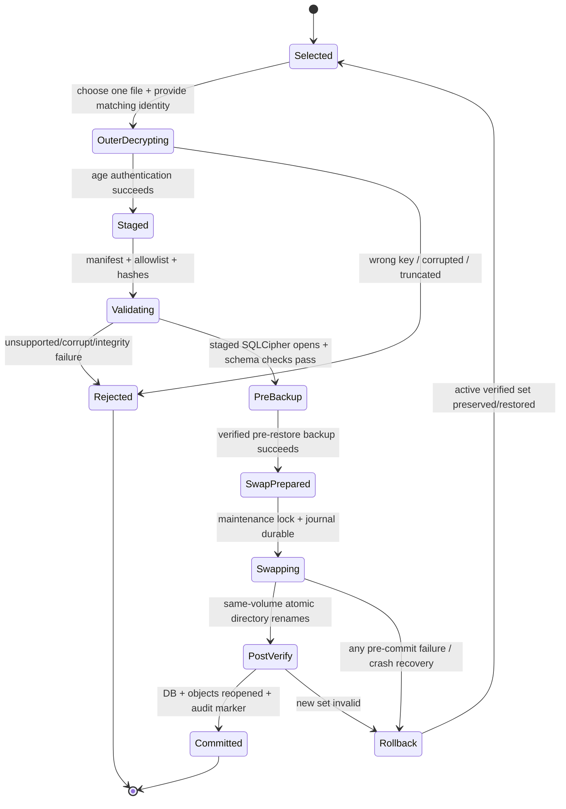

# Backup, restore and recovery design

**Status:** Proposed, based on ADR-0004. No product backup implementation/format, scheduler, portable restore test or Windows restore-state-machine test exists. The isolated spike contains only a SQLCipher Online Backup API test scaffold; it is unrun and does not test portable recovery.

## 1. Objectives and failure model

Backups must be local/offline, portable across supported Windows PCs/profiles, encrypted and tamper-detectable, complete (database + attachment objects + version metadata), consistent during writes, self-contained, and safe to restore without silently replacing the only healthy clinic copy. The service must explain key loss, wrong-key, corruption, unsupported schema, destination failure and cancellation without claiming success prematurely.

The backup destination may be a user-chosen local, removable or network-accessible folder. It is a user decision and may be physically lost or copied. The active SQLite database remains in local app data and must not be opened from network/OneDrive/removable storage.

## 2. Key and file model

- The active SQLCipher `K_db` is random 256-bit material protected locally with DPAPI CurrentUser. It is not a user password.
- Attachment content is encrypted with an authenticated cipher under a separate random attachment key held in the encrypted DB. Opaque file ID and format version are authenticated associated data. A directory copy does not reveal bytes; a missing/corrupt file is reported without deleting its clinical reference.
- At first-run setup, generate an `age` X25519 recovery keypair. Persist only the public recipient in clinic settings. Export/show the private identity once, require an owner-selected offline storage destination, and confirm the saved identity by decrypting a one-time challenge. Do not keep the private identity in the normal app profile. Keep older private identities as needed for historical backup recipients.
- Backups may be scheduled unattended because encryption uses a public recipient. Restore requires the matching user-held private identity; app login password and DPAPI blob are not substitutes.
- Losing the private identity while also losing the original Windows profile makes backups unrecoverable. Show this before setup and backup finalization; never fabricate a reset process.

## 3. Versioned `.dcmsbackup` package

Candidate format is an outer age-encrypted stream containing a strict archive with:

1. `manifest.json`: backup-format version, application/schema/SQLCipher profile, random clinic/database ID, UTC creation time, public recipient/key ID, explicit entry list, sizes and SHA-256 hashes. No patient names, phone numbers, clinical notes, invoice numbers, recovery private identity or full destination path.
2. `database/clinic.sqlcipher`: consistent SQLCipher Online Backup API snapshot or a separately reviewed SQLCipher export copy; stays encrypted with the clinic key.
3. `objects/<opaque-id>.enc`: already encrypted attachment objects only; no original filenames as archive paths.
4. `keys/db-key.age`: `K_db` independently encrypted to the same X25519 public recipient so outer-decrypted staging never contains plaintext DB key.
5. No logs/cache/temporary files, plaintext settings, WebView profiles, password verifiers outside the encrypted DB, activation input/verifier or developer/test data.

Container handling rules: fixed canonical relative paths; allowlist only; no absolute paths, `..`, symlinks, hardlinks, duplicate names or device files; maximum entry count and size; stream rather than loading all bytes; reject unknown versions, malformed manifests, hash mismatch and compression bombs. Exact archive library/format must be chosen from maintained, license-compatible dependencies and pinned before code.

The outer age envelope provides confidentiality and authenticated integrity. The inner SQLCipher/file encryption remains in staging, and `K_db` stays inside its nested age ciphertext. OS ACLs still apply to staging; do not store temporary clear patient data there.

## 4. Create flow

```text
manual request or scheduled trigger
→ actor/session/backup permission check (scheduled task uses its designated profile policy)
→ create backup_runs row = started
→ acquire single-instance + backup snapshot lock
→ checkpoint/consistent SQLCipher backup to local restricted staging
→ validate destination DB using same cipher key; integrity + foreign keys
→ snapshot immutable encrypted attachment objects and manifest hashes
→ age-encrypt K_db to public recipient; pack ciphertext entries
→ age-encrypt package stream to same recipient
→ write <name>.partial; flush file data; verify size/hash/finalized stream
→ atomic rename to unique <clinic>-<UTC timestamp>-<random suffix>.dcmsbackup
→ backup_runs = succeeded; audit; release lock; emit safe status event
```

If no secret recovery key is available during backup creation, that is expected; the public key is sufficient. SQLCipher backup semantics must be proven on the exact build. SQLCipher 4.3.0 is documented in Zetetic community discussion as supporting Online Backup API for encrypted→encrypted of the same type; this must be confirmed in the selected current build and on Windows before relying on it. No hand-copy of a live main `.db` while WAL is active.

Failure behavior:

- Existing valid backups are never overwritten silently; generate a unique new name and apply retention only after new package verification.
- Cancellation before final rename deletes the partial output and leaves prior backup/current DB intact.
- Disk full, missing/locked destination, access denied, SQLCipher error, age failure or process crash marks failure and cleans only the partial/staging operation. It does not report success based on a progress percentage.
- Re-read the completed destination to verify size/hash. The app can verify the output it just created with its own data and ensure all entries/hashes were included; it does not need the private recovery identity to encrypt a public-key backup.
- Log only backup ID, safe failure category, byte size, timestamp and outcome; never a recovery key or record content.

## 5. Restore state machine



### Required checks before commit

- Correct age recipient identity; authenticated outer and inner key wrap; no key in a command argument or log.
- Supported package/app/schema/cipher version and clinic/database identity policy.
- Manifest allowlist, file count/size limits, duplicate/path traversal/symlink rejection, every file hash, no missing/extra attachment object.
- SQLCipher database opens with recovered `K_db`; `PRAGMA integrity_check`, `foreign_key_check`, migration compatibility, business-level balance/stock invariants and audit-chain consistency.
- Attachment format/key metadata, AEAD tags and sampled/full object hashes; restore must not leave unreadable references.
- Verified pre-restore backup of current state. If there is not enough disk or the pre-backup fails, abort before touching the active directory.

### Atomic switch and crash recovery

- Active data, attachments, stage, previous copy and journal live on the same local NTFS volume to permit same-volume directory rename. Do not claim atomicity for moves between volumes.
- Create an operation journal with random operation ID, old/new directory hashes, stage path ID and explicit state. Flush journal and directory/file data before rename.
- Close DB handles, stop scheduled task for this profile, revoke session/print jobs, rename current data directory to retained previous and stage to active. Verify the active DB and attachments, write restore audit event, then mark journal committed. On startup, if journal state is incomplete, verify old and new directory manifests and deterministically complete or roll back; never guess based only on a filename.
- Retain old directory until post-swap verification and an explicit retention policy; a background cleanup must not remove the only verified copy.
- On every injected failure/cancel before commit, current state remains byte-for-byte or semantically verified. Once swap begins, finish journal recovery or restore the old verified directory before opening the app.

## 6. Schedule and catch-up semantics

- User chooses backup folder, recurrence (candidate 7/15/30 days), and retention. No production path is hard-coded.
- A per-user Task Scheduler entry may launch the signed app in a restricted hidden `--scheduled-backup` maintenance mode at a chosen local time. It must run as the designated Windows user and must not store a Windows password. Its command-line arguments contain no patient data, database key, activation code, password or recovery private key.
- The process acquires a named single-instance/database lock, uses DPAPI CurrentUser in that user context, and encrypts only with the public age recipient. It records status in `backup_runs` and a safe local diagnostic entry.
- If machine or profile is unavailable/off, mark the run due/missed and attempt at next logon/app startup (one catch-up package, not a burst for every missed date). The app is never described as continuously backing up while powered off.
- If the chosen drive/folder is unavailable, disk full, not writable or the task is disabled, record failure and create a genuine in-app notification on next launch. No silent retry loop or toast claiming success.
- Scheduled task path/version/update/uninstall behavior and Windows account profile access need explicit install/upgrade tests. Uninstall should unregister the task but preserve clinic data and backups unless a separate confirmed purge is selected.

## 7. Retention, export and key rotation

- Keep at least one prior verified backup; retention count/age and deletion ordering require owner-approved settings. Never delete a pre-restore backup as a side effect of restoring another one.
- Backup filenames must be safe and non-identifying by default (random clinic token + UTC timestamp); contents are encrypted; no patient name or diagnosis in filename.
- Replacing the recovery recipient generates a new key pair, challenge-confirms export, and rewraps `K_db` to the new public recipient for future backups. Historical backups retain their old recipient ID; the owner must preserve the corresponding old private identity. Do not silently make old media unrestorable.
- Database-key rotation is a maintenance migration: verified backup, key stage, SQLCipher rekey, integrity checks, DPAPI envelope swap and crash journal. Attachment encryption key rotation is separate because it may need a full file rewrite. The exact atomic protocol is a release blocker if rotation is exposed in v1.
- The `.dcmsbackup` is not a plain data export. Any human-readable clinical/financial export is a distinct, permissioned, audited workflow and must not be confused with backup.

## 8. Test and acceptance plan

### Unit/format tests

- Manifest version/ranges, canonical file names, hashes/sizes, duplicate entries, maximum limits, wrong key, wrong recipient, truncated age streams, modified tag, corrupted inner key wrap and decompression limits.
- Deterministic fixtures contain synthetic non-identifiable data only; no activation/recovery secrets. Generate cryptographic keypairs randomly during tests and delete temporary files.
- Round-trip preserves DB schema/migration state, patients/visits/chart/prescriptions/invoices/payments/stock/audit plus every attachment hash; old/new record snapshots compare exactly.

### Windows integration/restore fault matrix

Inject failure after each point: backup lock, SQLCipher snapshot, key-wrap, manifest, encryption, partial flush, rename, task launch, outer decrypt, inner key unwrap, archive extraction, SQLCipher open, integrity check, attachment check, pre-restore backup, journal create, old-dir rename, stage rename, DB reopen, audit write and cleanup. For every failure verify the active clinic remains accessible and the application does not claim restore success.

Test wrong recovery identity, corrupt/wrong SQLCipher key, incompatible/newer schema, unsupported cipher, missing attachment, tampered file, extra/traversal archive entry, duplicate names, locked directory, changed drive letter, read-only media, disk full, app process killed, task/app race, Windows sleep/shutdown, offline operation, missing Task Scheduler entry and catch-up on next logon.

### Evidence not yet run

No Windows runner, physical machine, task scheduler, backup file or restore test has been executed for Phase 1. See [`status-report.md`](status-report.md).

## References

- [ADR-0004 portable encrypted backup](adr/ADR-0004-portable-backup.md)
- [ADR-0002 local encryption/keys](adr/ADR-0002-data-encryption-and-keys.md)
- SQLite Online Backup API: <https://sqlite.org/backup.html>
- SQLite WAL limitations: <https://www.sqlite.org/wal.html>
- SQLCipher online backup discussion (validate selected build): <https://discuss.zetetic.net/t/using-the-sqlite-online-backup-api/2631>
- `age` Rust streaming format/API: <https://age-encryption.org/v1>, <https://docs.rs/age/latest/age/>
- Windows DPAPI CurrentUser behavior: <https://learn.microsoft.com/en-us/windows/win32/api/dpapi/nf-dpapi-cryptprotectdata>
- Phase 0 acceptance/release plan: [`../phase-0/test-and-release-plan.md`](../phase-0/test-and-release-plan.md)
