# Relational data model — normalized ERD and data dictionary

**Status:** Proposed production logical model; no production schema or migration has been created. The isolated spike's synthetic `proof_records` table is not a product schema. Physical types, exact names and indexes are subject to SQLCipher/SQLite Windows proof and design review. This model maps the DB-001/002/003 requirements in `docs/phase-0/requirements-spec.md`.

## 1. Modeling rules

- One encrypted database represents one clinic. There is no `tenant_id` on every row and no multi-clinic/shared-LAN design. A stable random `clinic_id` still identifies backup/snapshot ownership.
- Backend-generated random UUID identifiers are primary keys. Human-visible patient/invoice/document codes are separate and constrained unique. IDs are never authority; every lookup applies permission and relationship checks.
- Persist instants as signed UTC epoch milliseconds (or one equivalent canonical UTC representation after implementation proof); persist business dates and DOB/expiry as date-only `YYYY-MM-DD`. Store the clinic zone as an IANA name (`Asia/Dhaka`) and bundle the conversion data. Do not fabricate DOB from approximate age.
- Store every BDT amount as signed 64-bit integer **poisha** (100 poisha = 1 BDT). Do not use `REAL`/floating point. Display BDT and `৳` consistently with two decimals. Tax/discount is off until clinic configuration; no legal rate is hardcoded.
- Line quantities use integer thousandths (`quantity_milli`) plus a unit code. Service-layer arithmetic uses checked integer intermediates and an explicit half-up rounding rule. `line_total_paisa = round_half_up(unit_price_paisa × quantity_milli / 1000) − discount_paisa + tax_paisa`; line/invoice totals are recomputed and cross-checked inside the posting transaction.
- Use `STRICT` tables and explicit `CHECK`, `UNIQUE`, `NOT NULL`, foreign keys and indexes only if the bundled SQLite/SQLCipher build supports the exact selected feature set. Enable foreign keys on every connection; do not depend on UI validation.
- Use append-only status, payment, stock, audit and finalized-document events. Soft deactivation is the ordinary lifecycle; hard purge is separate, heavily authorized, audited and subject to owner/local legal policy.
- Query only fields a role may receive. Search indexes, totals, counts, notifications and report projections remain sensitive data endpoints. FTS virtual tables are protected by SQLCipher and contain only explicitly approved searchable fields.

## 2. ERD

The ERD groups entities by bounded context. `1:N` and `M:N` edges are represented by standard Mermaid relationship notation. It omits audit actor edges and some lookup tables for legibility; the data dictionary below is authoritative for those.

```mermaid
erDiagram
  CLINIC_PROFILE ||--o{ CLINIC_CONTACTS : has
  CLINIC_PROFILE ||--o{ CLINIC_HOURS : defines
  CLINIC_PROFILE ||--o{ APP_SETTINGS : configures
  CLINIC_PROFILE ||--o{ STAFF_PROFILES : employs
  STAFF_PROFILES ||--o| DENTIST_PROFILES : may_be
  STAFF_PROFILES ||--o{ DENTIST_DESIGNATIONS : has
  STAFF_PROFILES ||--o{ DENTIST_QUALIFICATIONS : has
  DENTIST_PROFILES ||--o{ DENTIST_SCHEDULES : works
  STAFF_PROFILES ||--o| USERS : may_have_login
  USERS ||--o{ USER_ROLES : assigned
  ROLES ||--o{ USER_ROLES : grants
  ROLES ||--o{ ROLE_PERMISSIONS : defines
  PERMISSIONS ||--o{ ROLE_PERMISSIONS : includes
  STAFF_PROFILES ||--o{ STAFF_SALARY_RECORDS : history

  PATIENTS ||--o{ PATIENT_CONTACTS : has
  PATIENTS ||--o{ PATIENT_HISTORY_ITEMS : records
  PATIENTS ||--o{ APPOINTMENTS : books
  DENTIST_PROFILES ||--o{ APPOINTMENTS : scheduled_with
  APPOINTMENTS ||--o{ APPOINTMENT_EVENTS : changes
  PATIENTS ||--o{ QUEUE_ENTRIES : arrives
  APPOINTMENTS o|--o{ QUEUE_ENTRIES : may_create
  QUEUE_ENTRIES ||--o{ QUEUE_EVENTS : transitions
  PATIENTS ||--o{ VISITS : attends
  DENTIST_PROFILES ||--o{ VISITS : conducts
  VISITS ||--o{ CLINICAL_OBSERVATIONS : contains
  VISITS ||--o{ DENTAL_CHART_FINDINGS : observes
  VISITS ||--o{ CLINICAL_ADDENDA : amends
  VISITS ||--o{ PATIENT_TREATMENTS : records
  TREATMENT_CATALOG_ITEMS o|--o{ PATIENT_TREATMENTS : snapshots
  PATIENTS ||--o{ REFERRALS : receives
  VISITS o|--o{ REFERRALS : may_create
  PATIENTS ||--o{ ATTACHMENTS : owns
  VISITS o|--o{ ATTACHMENTS : may_link

  CLINICAL_TEMPLATE_VERSIONS ||--o{ PRESCRIPTIONS : may_seed
  PATIENTS ||--o{ PRESCRIPTIONS : receives
  DENTIST_PROFILES ||--o{ PRESCRIPTIONS : prescribes
  VISITS o|--o{ PRESCRIPTIONS : may_link
  PRESCRIPTIONS ||--|{ PRESCRIPTION_ITEMS : contains
  DOCUMENT_TEMPLATE_VERSIONS ||--o{ PRESCRIPTIONS : renders_with

  PATIENTS ||--o{ INVOICES : billed
  VISITS o|--o{ INVOICES : may_link
  INVOICES ||--|{ INVOICE_LINES : contains
  TREATMENT_CATALOG_ITEMS o|--o{ INVOICE_LINES : source_only
  DOCUMENT_TEMPLATE_VERSIONS ||--o{ INVOICES : renders_with
  INVOICES ||--o{ INVOICE_EVENTS : changes
  PATIENTS ||--o{ PAYMENTS : pays
  PAYMENTS ||--o{ PAYMENT_ALLOCATIONS : apportions
  INVOICES ||--o{ PAYMENT_ALLOCATIONS : receives
  PAYMENTS ||--o{ PAYMENT_REVERSALS : reversed
  PAYMENT_REVERSALS ||--o{ REVERSAL_ALLOCATIONS : allocates
  PAYMENT_ALLOCATIONS ||--o{ REVERSAL_ALLOCATIONS : offsets
  ACCOUNTING_CATEGORIES ||--o{ ACCOUNTING_ENTRIES : classifies
  INVENTORY_PURCHASES o|--o| ACCOUNTING_ENTRIES : may_post_expense

  SUPPLIERS ||--o{ INVENTORY_PURCHASES : sells
  INVENTORY_PURCHASES ||--|{ INVENTORY_PURCHASE_LINES : contains
  INVENTORY_ITEMS ||--o{ INVENTORY_BATCHES : batched
  INVENTORY_PURCHASE_LINES ||--o| STOCK_MOVEMENTS : posts
  INVENTORY_ITEMS ||--o{ STOCK_MOVEMENTS : moves
  INVENTORY_BATCHES o|--o{ STOCK_MOVEMENTS : affects
  USERS ||--o{ NOTIFICATION_RECIPIENTS : receives
  NOTIFICATION_EVENTS ||--o{ NOTIFICATION_RECIPIENTS : delivered_to
  USERS ||--o{ AUDIT_EVENTS : acts
  USERS ||--o{ BACKUP_RUNS : initiates
  PRINTER_PROFILES ||--o{ DOCUMENT_TEMPLATE_VERSIONS : supports
  USERS ||--o{ IDEMPOTENCY_RECEIPTS : scopes
```

## 3. Data dictionary

The table descriptions below list canonical fields and invariants, not final SQL syntax. `id` means backend-generated random UUID text unless an entity explicitly needs a monotonic sequence. `created_at_utc_ms`/`updated_at_utc_ms` are UTC instants. `created_by_user_id` is derived by Rust and must not be accepted from a caller DTO.

### Clinic, staff and access control

| Entity | Key fields / relationships | Rules |
|---|---|---|
| `clinic_profile` | `clinic_id PK`, legal/display name, logo attachment ID, address/contact/tax/footer/advice defaults, `timezone_id`, setup status, created/updated times | Exactly one active row. Final setup commits atomically. No fabricated tax values or identity. |
| `clinic_contacts` | `id PK`, `clinic_id FK`, contact type/value/label, sort order | Multiple phones/emails/URLs; normalized type/value. |
| `clinic_hours` | `id PK`, `clinic_id FK`, ISO weekday, open/close local time, closed flag | Check close > open or model overnight explicitly; timezone belongs to clinic. |
| `app_settings` | `setting_key PK`, schema version, validated JSON value, updated by/time | Key allowlist with per-setting schema; no generic arbitrary write. Printer, backup, auto-lock, locale, search/retention preferences only. Secrets are not stored here. |
| `staff_profiles` | `staff_id PK`, `clinic_id FK`, name, employment role/section, optional DOB/date context, address/contact/ID/photo attachment, status, joining date, notes | Account independent; PII fields individually permissioned. Avoid over-collection. Soft-deactivate. |
| `dentist_profiles` | `dentist_id PK`, unique `staff_id FK`, professional/registration metadata, signature attachment/config | Optional one-to-one extension of staff; only authorized roles. |
| `dentist_designations` | `id PK`, `dentist_id FK`, display text, ordering/effective dates | Separate normalized rows; historical document snapshot copies displayed text. |
| `dentist_qualifications` | `id PK`, `dentist_id FK`, qualification/certification text, institution/date/order | No implicit medical license/certification claim. Snapshot at document issue. |
| `dentist_schedules` | `id PK`, `dentist_id FK`, weekday, local start/end, valid-from/to, active | Overlap validation in a transaction; policy warning/override audited. |
| `staff_salary_records` | `id PK`, `staff_id FK`, effective-from/to, amount in poisha, frequency, notes | Separate salary permission and audit; never in general staff/search DTO. |
| `users` | `user_id PK`, optional unique `staff_id FK`, case-insensitive unique username, Argon2id PHC verifier, enabled/disabled state, password-change time, `authz_epoch`, login timestamps | No default password. No salary/clinical profile embedded. Soft-disable; no password in logs. |
| `roles` | `role_id PK`, unique stable `role_code`, display name, system/custom flag, active state | Seed roles with migration; system roles cannot be renamed into different semantics. Custom roles default deny. |
| `permissions` | stable `permission_key PK`, module/action, sensitive-data class, description, re-auth requirement | Seed catalog; application compares stable keys, not display labels. |
| `user_roles` | composite/unique `(user_id, role_id)`, assigned by/time, optional scope | Role union is effective grant; remove/revoke increments authz epoch and audits. |
| `role_permissions` | composite PK `(role_id, permission_key)`, granted by/time | Presence is grant; absence denies. No implicit deny-overrides. |

### Patients, appointments and clinical history

| Entity | Key fields / relationships | Rules |
|---|---|---|
| `patients` | `patient_id PK`, unique normalized patient code, full name, nullable DOB, optional reported age + recorded-at context, gender/blood group where configured, address, referral source, active/inactive state, registered at/by | No derived fake DOB. Unique code constraint is case/Unicode-normalization aware. Deactivate rather than cascade-delete. |
| `patient_contacts` | `id PK`, `patient_id FK`, type, value, label, primary flag, valid-from/to | Multiple normalized contacts; format is display not authorization. |
| `patient_history_items` | `id PK`, `patient_id FK`, kind (allergy/medical/dental/other), code/text, severity/status, onset/resolved dates, source, entered by/time, optional ended-by | Longitudinal history; never include in receptionist/finance projections without permission. |
| `appointments` | `appointment_id PK`, `patient_id FK`, `dentist_id FK`, start/end UTC, reason/type, current status, creation source, optimistic version, created/updated by/time | `end > start`; overlap check at service/transaction layer; not a visit. Status is a current projection of events. |
| `appointment_events` | `event_id PK`, `appointment_id FK`, from/to status, old/new start/end, reason, actor/time | Append-only reschedule, cancel, arrival, no-show and completion history. |
| `queue_entries` | `queue_id PK`, `patient_id FK`, nullable `appointment_id FK`, arrived UTC, priority, state, clinician, version | Walk-ins allowed. At most one active queue item for a governed key through a partial unique index if policy allows. |
| `queue_events` | `event_id PK`, `queue_id FK`, from/to state, event time, actor, reason | Append-only and idempotent; wait derived from stored timestamps. |
| `visits` | `visit_id PK`, `patient_id FK`, nullable appointment/queue IDs, `dentist_id FK`, opened/occurred/finalized UTC, reason, state/version, current-summary fields only while draft | Appointment != visit. Finalization snapshots meaningful content and closes mutable draft. |
| `clinical_observations` | `observation_id PK`, `visit_id FK`, kind (complaint/exam/assessment/advice/follow-up), optional configured code, free text, order, entered by/time | Optional vocabulary plus free text; no auto-diagnosis. Finalized observations immutable. |
| `clinical_addenda` | `addendum_id PK`, `visit_id FK`, reason, correction text/target, created by/time | Append-only, permissioned and audited; never silently rewrite original finalized visit. |
| `dental_chart_findings` | `finding_id PK`, `visit_id FK`, two-character FDI tooth code, dentition, surface, condition code, text, recorded by/time | Validate adult FDI 11–48 and primary 51–85 ranges plus valid position/surface. Preserve findings per visit. |
| `treatment_categories` | `category_id PK`, clinic, code/name, active/order | Lookup-like clinic values; deactivation preserves existing references. |
| `treatment_catalog_items` | `item_id PK`, category FK, stable code, name/description, fee in poisha, duration minutes, tax/discount policy, active/version | Current catalog only; edits never mutate historical service/invoice snapshots. |
| `patient_treatments` | `treatment_id PK`, `visit_id FK`, patient/dentist, optional catalog FK, description/quantity/unit/fee snapshot, status, created by/time | Historical snapshot, optional invoice-line link; transactionally linked to visit/invoice when requested. |
| `referrals` | `referral_id PK`, `patient_id FK`, optional visit, source/recipient, date, reason/instructions/follow-up, status, actor/time | Preserve as a history event; sensitive content only to authorized roles. |
| `attachments` | `attachment_id PK`, patient FK, optional visit/referral FK, opaque storage ID, encrypted content key/version/nonce, MIME/type/size/SHA-256, original safe filename, status, actor/time | Bytes stored outside DB under opaque ID, encrypted at rest. Validate magic/type/size; path never comes from an arbitrary renderer string. |

### Prescriptions and document templates

| Entity | Key fields / relationships | Rules |
|---|---|---|
| `clinical_templates` | `template_id PK`, clinic, template type, display name, active/version | Configuration only; no mutation of prior records. |
| `clinical_template_versions` | `version_id PK`, `template_id FK`, canonical validated content JSON, created by/time, content hash | Immutable once used; no scripts/external URLs in template data. |
| `prescriptions` | `prescription_id PK`, patient/dentist, optional visit FK, issue time, draft/final state, template version FK, version, final render snapshot JSON/hash, finalized by/time | Finalized snapshot includes clinic/dentist/patient identity and exact issue-time instructions/profile. Reprint uses this snapshot. |
| `prescription_items` | `item_id PK`, `prescription_id FK`, position, medicine/form/strength/dose/frequency/timing/food/duration/quantity/route/conditional/custom instructions | User-authored/free-text; no automated dose advice. Immutable after finalization; no lost Bengali text. |
| `document_templates` | `template_id PK`, clinic, document type, display name, active profile | Source assets are local signed/bundled code; only safe configuration stored. |
| `document_template_versions` | `version_id PK`, `template_id FK`, version code, paper profile, CSS/template hash, created time, supported runtime floor | Immutable version registry; HTML/CSS assets themselves stay local, not user-supplied script. A document stores the version used. |
| `printer_profiles` | `profile_id PK`, name, exact Windows device name (optional), document type, paper width/height, units, margins, orientation, default flags, created/updated by/time | UI offers only supported dimensions for the selected driver. No printer path is executed as shell text. |

### Invoices, payments and accounting

| Entity | Key fields / relationships | Rules |
|---|---|---|
| `number_sequences` | composite clinic/document-type key, next integer, prefix/format/version | Increment inside `BEGIN IMMEDIATE` posting transaction; public number has unique constraint and cannot be reused. |
| `invoices` | `invoice_id PK`, unique invoice number, patient/optional visit, issue time, status, issue-time clinic/patient identity snapshot, template version, subtotal/discount/tax/total in poisha, created/issued by/time, version | Draft may edit; posted/issued identity and totals are immutable. Persisted totals are deliberate reconciled snapshots; paid/due are derived from allocations/reversals. |
| `invoice_lines` | `line_id PK`, invoice FK, optional catalog/treatment FK, description/unit/quantity-milli/unit-price/discount/tax/line-total snapshots, position | All historical display/calculation fields immutable after issue; checked against integer formula. |
| `invoice_events` | `event_id PK`, invoice FK, from/to status, reason, actor/time | Append-only; void requires specific permission/re-auth and cannot delete original lines. |
| `payments` | `payment_id PK`, patient FK, captured amount in poisha, method enum (cash/bank/card/mobile wallet), wallet subtype/reference, timestamp, receiver/user, status/notes | Payment capture does not imply invoice allocation or revenue analytics. Reversal never deletes payment. |
| `payment_allocations` | `allocation_id PK`, payment FK, invoice FK, amount poisha, allocated by/time | Sum cannot exceed captured payment (except explicitly configured unapplied credit); invoice balance is calculated transactionally/query-wise. |
| `payment_reversals` | `reversal_id PK`, payment FK, amount, reason, method/reference, actor/time | Partial/full reversal; re-auth and audit; no destructive edit. |
| `reversal_allocations` | `id PK`, reversal FK, original allocation FK, amount poisha | Sum cannot exceed original allocation/reversal; invoice balance remains exactly reconcilable. |
| `accounting_categories` | `category_id PK`, direction (other income/expense), name/code, active | Patient payment receipts are not manually re-added as income. |
| `accounting_entries` | `entry_id PK`, category FK, direction, amount poisha, transaction UTC, payee/source/ref, notes, status, actor/time, optional inventory purchase FK | Manual income/expense; purchase posting links uniquely to purchase. Updates use reversal/correction entries. Reports deduplicate source events. |

### Inventory, notifications, audit and operations

| Entity | Key fields / relationships | Rules |
|---|---|---|
| `suppliers` | `supplier_id PK`, name/contact/address/active/notes | Soft deactivate; no supplier record grants patient/finance access. |
| `inventory_items` | `item_id PK`, unique optional SKU, name/category/unit/min quantity, active, cost permission class | Stock quantity is not stored as authoritative mutable balance. |
| `inventory_batches` | `batch_id PK`, item FK, supplier FK, batch/lot, expiry/purchase dates, optional unit cost poisha | Expiry/batch data preserved; repeated lots have deterministic identity policy. |
| `inventory_purchases` | `purchase_id PK`, supplier FK, reference/date, subtotal/tax/total poisha, status, actor/time | Posting creates immutable purchase lines/stock movements and one linked accounting expense if configured. |
| `inventory_purchase_lines` | `line_id PK`, purchase FK, item/batch FK, quantity-milli, unit cost, line total | Cannot edit after posting; corrections use reversal/adjustment movement. |
| `stock_movements` | `movement_id PK`, item/batch FK, signed quantity-milli, type (opening/purchase/consume/adjust/reversal), reason, source reference, actor/time | Append-only; service transaction checks resulting on-hand is nonnegative by default. On-hand = opening + movement sum. Any materialized summary is rebuildable/non-authoritative. |
| `notification_events` | `event_id PK`, unique idempotent event key, type, source type/opaque source ID, safe message key, created/expiry times | Avoid sensitive text in stored summary; client fetches fresh permission-checked details. Source reference is not authority. |
| `notification_recipients` | `(event_id,user_id)` PK, delivered/read/dismissed times | Deduplicate; read state per user. Counts are permission-filtered. |
| `audit_events` | monotonic sequence PK, event UUID, actor FK, action/resource type/opaque ID/outcome, safe summary key, UTC time, previous/event SHA-256 hash | Application append-only, update/delete disabled; chained hash is tamper-evident for accidental changes only, not a local-admin security guarantee. No unnecessary narrative/secrets. |
| `backup_runs` | `backup_id PK`, started/finished UTC, status, format/schema/cipher versions, public recipient ID, byte count/hash, destination class (not full sensitive path), actor/scheduler origin, safe error code | Never store recovery private identity or secret; logs/notifications show real completion/failure. |
| `idempotency_receipts` | unique `(user_id, command_name, idempotency_key)`, request digest, outcome/resource ID, created/expiry | Prevent repeat payment/stock/transition operation. A mismatched payload reusing a key is rejected. |
| `schema_migrations` | integer version PK, stable migration ID/checksum, applied UTC, app version | Applied scripts immutable; unknown/newer schema fails closed; restore compatibility checked before swap. |
| `app_key_material` | purpose/key ID, encrypted-DB stored random attachment key/material, algorithm/version, created/rotated time | The DB encryption layer protects this table; recovery backup's `K_db` wrapper remains separately encrypted. No key enters UI/IPC/log. |

## 4. Integrity, retention and deletion rules

- **Patients/staff/dentists:** deactivate/soft-delete; no cascade delete through visits, appointments, invoices, payments, audit or attachments. Patient merge, if implemented, is a separate previewable, transactional and audited workflow—not part of a basic delete action.
- **Clinical visits, finalized prescriptions, chart findings, addenda and referrals:** final records immutable. Corrections append a reasoned addendum/amendment with actor/time; drafts may be deleted only through a separately permissioned transaction and audit.
- **Invoices/payments/accounting:** issued invoice line/snapshot values immutable. Void, refund, reversal or correction creates a linked event/entry. No `ON DELETE CASCADE` for any posted financial record or allocation.
- **Inventory:** stock movement is append-only; corrections add inverse/replacement movements. A posted purchase is reversed as a whole/line with traceable movement and accounting reversal.
- **Attachments:** logical delete marks inactive and creates an audit event; physical purge is separate retention-controlled maintenance and must not leave a dangling clinical record. Backup restore verifies every referenced object/hash.
- **Users/roles/permissions:** disable/revoke without deleting audit identity. Permission catalog seed rows are migration-owned; user-facing audit edit/delete is absent.
- **Notifications/idempotency:** may be expired/compacted under explicit retention rules only after audit/consumer needs are met; no such period is invented here.
- **Database file:** migration or key open failure never creates a new blank clinic over the old unreadable file. Keep a pre-upgrade/pre-restore verified copy where safe.

## 5. Constraints and query indexes

### Required constraints

- Unique normalized patient code; case-insensitive unique username; unique per-clinic invoice number and document sequence; stable unique role/permission code; unique notification event/dedup key; unique stock-purchase source link.
- `CHECK (end_at_utc_ms > start_at_utc_ms)`, nonnegative money/quantity fields where semantically required, known enumerated status/type/direction values, exact currency `BDT`, and valid date/FDI code formats.
- Foreign keys use `RESTRICT` by default for clinical/financial records. `SET NULL` is acceptable only for non-essential optional references when the history snapshot survives. Cascade is limited to unposted child drafts and ephemeral operation rows after a documented transaction.
- Use a transaction plus service-level aggregate checks for invoice totals, payment allocation/reversal, stock balance, role-grant epoch and setup. SQLite `CHECK` cannot by itself enforce every cross-row sum.
- Every multi-record write uses `BEGIN IMMEDIATE` or equivalent bounded serialization. Unique constraint errors map to safe conflict messages.

### Initial index candidates (validate with `EXPLAIN QUERY PLAN`)

- `patients(patient_code COLLATE NOCASE UNIQUE)`, plus approved FTS5 index on name/code/phone/address; no clinical/financial/salary body text in global FTS by default.
- `patient_contacts(patient_id, is_primary, type)` and normalized phone lookup if permission grants it.
- `appointments(start_at_utc_ms, status, dentist_id, appointment_id)`, `(patient_id, start_at_utc_ms DESC)`, `(dentist_id,start_at_utc_ms,end_at_utc_ms)`.
- `appointment_events(appointment_id,event_at_utc_ms,event_id)`, `queue_entries(state,arrived_at_utc_ms)`, `queue_events(queue_id,event_at_utc_ms)`.
- `visits(patient_id,occurred_at_utc_ms DESC,visit_id)`, `(dentist_id,occurred_at_utc_ms DESC)`, `clinical_observations(visit_id,kind,position)`.
- `dental_chart_findings(visit_id,tooth_code,surface,condition_code)`; optionally patient history index by `(patient_id,kind,status)`.
- `prescriptions(patient_id,issued_at_utc_ms DESC,prescription_id)`, `(dentist_id,issued_at_utc_ms DESC)`, `prescription_items(prescription_id,position)`; approved medicine-name index only if permission-safe.
- `invoices(invoice_number COLLATE NOCASE UNIQUE)`, `(patient_id,issued_at_utc_ms DESC,invoice_id)`, `(status,issued_at_utc_ms)`; `invoice_lines(invoice_id,position)`.
- `payments(paid_at_utc_ms DESC,payment_id)`, `(patient_id,paid_at_utc_ms DESC)`, `(method,paid_at_utc_ms)`; `payment_allocations(invoice_id,payment_id)` and `(payment_id,invoice_id)`; reversals by payment/time.
- `inventory_items(active,category,name)`, `inventory_batches(item_id,expiry_date,batch_id)`, `stock_movements(item_id,batch_id,occurred_at_utc_ms,movement_id)`, `inventory_purchases(supplier_id,purchased_at_utc_ms)`.
- `accounting_entries(direction,occurred_at_utc_ms,category_id,entry_id)`; unique non-null purchase source.
- `notification_recipients(user_id,read_at_utc_ms,event_id)`, `audit_events(occurred_at_utc_ms,actor_user_id,resource_type,resource_id)`, `backup_runs(started_at_utc_ms,status)`.

FTS is an index, not an authorization shortcut. Search produces an authorized projection after candidate rows are selected; unpermissioned counts/snippets must not escape.

## 6. Transaction and state-transition boundaries

| Use case | Single atomic transaction / boundary |
|---|---|
| Initial setup | Save resumable encrypted wizard draft; final clinic profile/hours, dentist rows, roles/grants and owner user commit atomically; incomplete state cannot enter production routes. |
| Patient create/merge | Normalize/check code and duplicate warnings; create identity/contacts/history + audit + idempotency receipt; merge, if later approved, re-points dependents and records mapping in one transaction. |
| Visit finalize | Validate patient/dentist/permissions; freeze observations/chart/treatment snapshot; write final status and audit; no half-finalized visit. |
| Prescription finalize | Freeze ordered medicine lines + clinic/dentist/patient/render snapshot hash/template version and audit; print permission/read uses persisted state only. |
| Appointment/queue transition | Check expected version, allowed from→to state, schedule/override; append event and update current projection; duplicate/replayed command is safe. |
| Invoice issue | Lock/increment sequence; snapshot identity/catalog lines; calculate totals in poisha; issue status/event, optional linked treatment and audit; unique invoice number. |
| Payment capture/allocation | Insert payment and allocations; validate captured/allocated/reversed sums and invoice states; audit and update any rebuildable projections; all or none. |
| Refund/reversal | Re-authenticate; insert reversal and allocation offsets with reason; recompute due; audit; no delete/update of original capture. |
| Stock/purchase | Insert purchase/lines, stock movement ledger and linked expense; validate no-negative policy; every movement and accounting side commits together. |
| Role change | Validate assigner and target; update grants/assignment, increment `authz_epoch`, audit, invalidate active session/query cache at next command. |
| Backup/restore | Backup uses consistent snapshot outside ordinary write path with progress; restore is a separate filesystem journaled maintenance state described in ADR-0004. |

## 7. Migration/restore compatibility

- Migrations are numbered, embedded and checksummed. A shipped migration is immutable; correction is a later migration. Run from a verified backup under maintenance lock and transaction where supported.
- Check expected `user_version`, migration checksum and SQLCipher version before exposing protected data. A newer/unknown schema is never opened with downgrade assumptions.
- Restore validates backup `schema_version`, app minimum version and cipher profile before it can be activated. Migration-after-restore is staged against a copy and checked before swap.
- Integration tests inject failure after each migration statement/major transaction step, then reopen current/backup DB and run `integrity_check`, `foreign_key_check`, hash checks and domain invariants.

## References

- Phase 0 DB/financial/clinical requirements: [`../phase-0/requirements-spec.md`](../phase-0/requirements-spec.md)
- Phase 0 gaps and lifecycle assumptions: [`../phase-0/gap-analysis.md`](../phase-0/gap-analysis.md)
- [ADR-0002 data protection](adr/ADR-0002-data-encryption-and-keys.md)
- SQLite limits/transactions/WAL/backup: <https://sqlite.org/limits.html>, <https://www.sqlite.org/wal.html>, <https://sqlite.org/backup.html>
- SQLCipher API/licensing: <https://www.zetetic.net/sqlcipher/sqlcipher-api/>, <https://www.zetetic.net/sqlcipher/community/>
