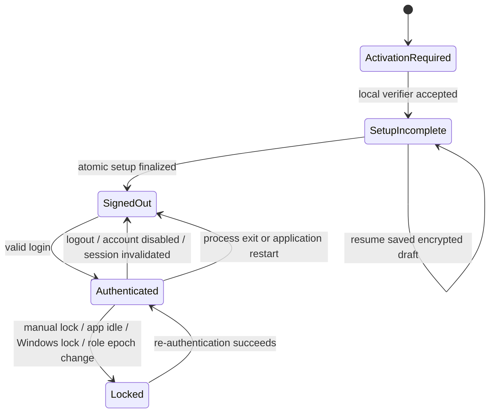

# IPC and client-state contract

**Status:** Proposed interface contract. No IPC commands, frontend app, Tauri capabilities or DTO source files exist yet. This contract is normative input to implementation and security tests.

## 1. Principles

1. Every frontend→Rust call is a named use case with a narrow typed request and typed result. No `execute_sql`, generic CRUD, arbitrary filesystem path, arbitrary command/shell, generic HTTP, raw database connection or “admin” boolean.
2. The backend derives the actor from the current in-process session. Request DTOs must not accept `actor_id`, `role_ids`, `permission_keys`, `authorized`, `is_admin` or a caller-controlled session token.
3. Rust owns validation, business rules, permission decisions, financial math, transaction scope, audit and result projection. TypeScript validation is for timely user feedback and is repeated in Rust.
4. Inputs use opaque IDs and validated values; resource IDs are not authorization. Every read and mutation rechecks the session, capability and resource scope.
5. The command set is explicitly registered in the Tauri build manifest; a main-window capability contains only the commands actually needed by that window. The print window receives a separate smaller command set. No remote origin receives a capability.
6. No patient, health, salary, authentication or financial data is written to `localStorage`, IndexedDB, browser cache, URL query parameters, console logs or generic telemetry.

## 2. Wire envelope and errors

All calls include a UUID `request_id` for correlation. Mutations additionally include a UUID `idempotency_key` and a request-specific version/ETag where optimistic concurrency applies.

```ts
type CommandResponse<T> =
  | { ok: true; requestId: string; data: T }
  | {
      ok: false;
      requestId: string;
      error: {
        code: SafeErrorCode;
        messageKey: string;
        fieldErrors?: Record<string, string>;
        retryable: boolean;
        correlationId: string;
      };
    };
```

`SafeErrorCode` is a closed enum such as `VALIDATION`, `UNAUTHENTICATED`, `LOCKED`, `FORBIDDEN`, `NOT_FOUND`, `CONFLICT`, `BUSY`, `STORAGE_UNAVAILABLE`, `INTEGRITY_FAILURE`, `PRINTER_UNAVAILABLE`, `CANCELLED`, `UNSUPPORTED_VERSION` and `INTERNAL`. Normal responses never contain raw SQL, filesystem roots, Rust stack traces, password/verifier values, recovery keys, clinical notes or driver-provided untrusted HTML. Technical details go to an ACL-protected redacted local log with the correlation ID.

## 3. DTO and query rules

- DTOs are versioned/derived from Rust `serde` types. Candidate approach: generate TypeScript declarations in CI from authoritative Rust DTO definitions, check generated files for drift, and use a small TypeScript runtime schema for untrusted UI form state. Exact codegen dependency is selected after license/maintenance review.
- Rust command arguments use snake_case internally and a single pinned serialization convention; the generated front-end contract owns casing/nullability. Optional values are explicit `Option`/nullable fields, not sentinel strings or `0` IDs.
- Enforce maximum lengths, numeric ranges, list/page sizes, attachment bytes and query complexity at the Rust boundary. Reject unknown enum values and malformed Unicode safely. Strings remain UTF-8; normalize identifiers to a documented Unicode normalization form before uniqueness/search.
- Use keyset/cursor pagination with a bounded page size (initial maximum 100). A cursor is opaque, integrity-checked, filter/sort-bound and permission-epoch-bound. Do not return total counts unless the caller has permission to know them. Stable order includes a deterministic ID tiebreaker.
- Return only fields needed by the requesting screen. Separate identity, clinical, sensitive-history, financial, salary, attachment and audit projections. A combined DTO is never used as a shortcut for all users.
- Large operations return an `operation_id` and progress via events; operations have explicit state, cancellation semantics and no false completion. Cancel is allowed before irreversible commit and is no-change; once an atomic restore commit starts, it must complete or recover.

## 4. Command families and permission contract

Names are illustrative, not implemented commands. Every endpoint maps to a permission key in [`security-and-rbac.md`](security-and-rbac.md).

| Family | Example use cases | Required server checks |
|---|---|---|
| Bootstrap/activation | `activation.status`, `activation.verify`, `setup.load_draft`, `setup.save_draft`, `setup.finalize` | Activation before first-run; no production data routes before setup; no activation code in response/log; final setup atomic. |
| Authentication/session | `auth.login`, `auth.lock`, `auth.unlock`, `auth.logout`, `auth.change_own_password`, `auth.reauthenticate`, `auth.session_projection` | Rate limits; Argon2id; current user enabled; server-owned actor; new session generation; no caller-chosen role. |
| Clinic/dentists/settings | `clinic.read_profile`, `clinic.update_profile`, `dentists.list`, `dentists.save`, `settings.read`, `settings.update` | Exact manage/read permission; audit sensitive changes; validated setting schema; no generic arbitrary key write. |
| Patients/clinical | `patients.search`, `patients.page`, `patients.get_identity`, `patients.get_clinical_profile`, `patients.create`, `patients.update_demographics`, `visits.create_draft`, `visits.finalize`, `visits.addendum`, `chart.read_visit`, `chart.record_finding` | Distinct identity/history/clinical permissions; patient relationship checks; immutable final snapshot; IDs cannot cross scope. |
| Scheduling/queue | `appointments.page`, `appointments.create`, `appointments.reschedule`, `appointments.transition`, `queue.page`, `queue.transition` | Dentist schedule/overlap policy; timestamp/status transition table; idempotency and event history. |
| Prescription/documents | `prescriptions.create_draft`, `prescriptions.finalize`, `prescriptions.get_snapshot`, `documents.create_preview_job`, `documents.print`, `documents.export_pdf` | Prescriber permission, finalized snapshot, separate preview/print/export permission, one-use job lease, output-path picker and audit. |
| Billing/payments | `invoices.create_draft`, `invoices.issue`, `invoices.current_transaction`, `invoices.history`, `payments.capture`, `payments.allocate`, `payments.reverse`, `finance.report` | Invoice entry != clinic analytics; integer poisha; allocation invariant; re-auth for void/reversal; permission-safe projections/aggregates. |
| Inventory/accounting | `inventory.page`, `inventory.move_stock`, `inventory.purchase`, `inventory.cost_report`, `accounting.entry.create`, `accounting.report` | Stock ledger/negative-stock policy; separate costs; no duplicate patient-payment income; audit. |
| Staff/access control | `staff.directory`, `staff.sensitive`, `staff.salary`, `users.manage`, `roles.manage`, `roles.set_grants` | Split profile/PII/salary permissions; role union; default deny; privilege edits increment `authz_epoch` and audit. |
| Search/notifications | `search.query`, `notifications.page`, `notifications.mark_read` | Search field/snippet/count permission per result; deduplicated notifications; no hidden data in event payload. |
| Files/backup/admin | `attachments.add`, `attachments.preview`, `attachments.export`, `attachments.delete`, `backup.create`, `backup.restore`, `audit.page`, `data.destroy` | Picker-scoped path validation; file type/size checks; separate export/delete; re-auth, maintenance lock, pre-backup and cancel/no-change. |

No command may accept an HTML template, arbitrary SQL fragment, arbitrary absolute destination path or a purported `isAuthorized` result from the client. The OS picker returns a path to Rust, which validates canonical path, volume, reparse points and allowed operation before opening it.

## 5. State-management contract

### Authoritative state

- Durable clinic records, finalized document snapshots, role grants, settings, audit and backup status: Rust services + encrypted SQLite/files.
- Active session, re-auth timestamp, lock deadline, print leases, maintenance mutex and transient errors: Rust process memory.
- Client-side query cache: disposable authorized projections only; never an authority or durable source.
- Client navigation, selected tab, modal and unsaved field state: in-memory React UI state only. Persist drafts only via an explicit Rust save use case to an encrypted, permission-checked draft record.

### Frontend stores

- A query/cache layer (candidate TanStack Query) is keyed by user/session `authz_epoch`, resource, filters and cursor. The cache is disabled for persistent disk storage, background persistence, service-worker caching and cross-user reuse.
- A small local store (React context or similarly audited lightweight store) owns navigation, search overlay, preferences that are non-sensitive, and ephemeral form drafts. Avoid duplicate persisted domain state or a broad state framework.
- Set background refetch/stale behavior deliberately; every mutation invalidates affected query keys only after a successful result. Rejected responses do not optimistically change money, stock, clinical status or audit screens.
- On lock/logout/re-auth failure/session change/role-epoch change/restore: immediately obscure protected windows, cancel in-flight work where possible, clear all query caches/forms/print previews, close one-use print jobs and fetch a fresh session projection before showing data.

### Session state machine



Restore and destructive maintenance temporarily move the backend into `Maintenance`; all ordinary writes are rejected and existing renderer caches are cleared. The client cannot transition itself into `Authenticated` or bypass activation/setup. On Windows workstation lock/suspend, the app locks immediately; on resume, re-authentication is required. Default inactivity choices follow Phase 0 (5/10/15/30 minutes); the app must warn/preserve drafts and not silently discard input.

## 6. Events and long-running operation protocol

Events are notifications to refresh authorized data, not a privileged data channel:

- `session.changed`: status and monotonically increasing epoch only.
- `operation.progress`: opaque operation ID, operation kind, bounded progress stage/percent and safe status.
- `backup.status.changed`: backup-run ID/state; no folder path, recovery recipient or patient data.
- `notification.changed`: opaque event ID/unread count only; client fetches a role-authorized projection.
- `data.invalidated`: entity family + opaque IDs and revision, only if the current role can know them.
- `print.job.status`: opaque job ID + one of preview-ready/submitted/failed/cancelled/expired; no HTML/PDF bytes in event.

Progress cannot claim a successful spool or backup until native/stream completion, flush, integrity validation and atomic destination commit have occurred. Cancel requests are idempotent; a committed operation returns a safe conflict/“too late to cancel” result.

## 7. IPC abuse and regression tests

- Directly invoke every protected command without login, while locked, as disabled user, after role revocation and with stale `authz_epoch`; expect denial and no DB change.
- Forge actor/user/role/permission fields, cross-patient resource IDs, filters/cursors, payment values, invoice prices, stock deltas, backup paths and print-job IDs; reject or ignore authority fields and verify audit/status.
- Fuzz missing/null/unknown enum/oversized/nested DTO fields, malformed Unicode, duplicate JSON keys, path traversal and repeated idempotency keys.
- Test denied data through totals, counts, snippets, notifications, dashboard, search, print render DTO and export—not only direct record queries.
- After lock/role-change/restore/reload, assert that no patient/financial text remains visible in cached routes, modal state, browser storage, event payloads or logs.
- Mutations at every transaction boundary have injected failure/no-false-success tests. Events are emitted only after commit or carry an explicit failure state.

## References

- Tauri capability and command configuration: <https://v2.tauri.app/security/capabilities/>
- Tauri custom command permission manifest: <https://docs.rs/tauri-build/latest/tauri_build/struct.AppManifest.html>
- [Security/RBAC design](security-and-rbac.md)
- [System architecture](system-architecture.md)
- Phase 0 requirements: [`../phase-0/requirements-spec.md`](../phase-0/requirements-spec.md)
