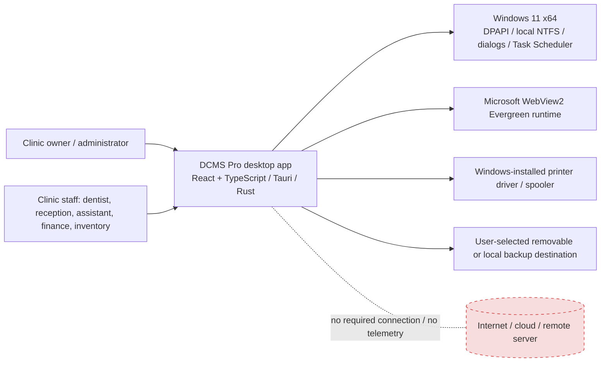
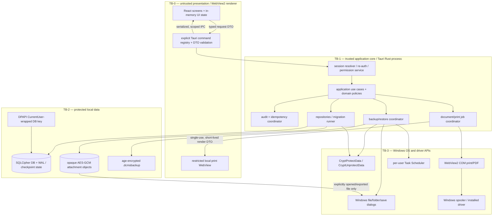

# System architecture and trust boundaries

**Status:** Candidate production architecture aligned to ADR-0001; not locked until blocking Windows gates pass. No product source or runtime process is implemented; the isolated proof harness is not product code.

## 1. System context



The dashed edge is a non-connection requirement: normal app operations have no remote service dependency. Windows may service WebView2 when connected, but the installed application must launch and complete required local workflows with network access blocked. The Windows print subsystem and user-selected storage destination are explicit local OS integrations, not a DCMS Pro cloud service.

## 2. Container and trust-boundary view



| Boundary | Data crossing | Required controls |
|---|---|---|
| **TB-0 UI → Rust IPC** | Validated DTOs, opaque IDs, authorized projections and safe errors | Tauri capability/command allowlist; no caller-supplied actor, permissions, SQL or OS path authority; enforce RBAC in services; byte/string/count limits; runtime schema validation; idempotency on mutations; no PII in generic errors. |
| **TB-1 → SQLite/managed files** | Transactional domain operations, encrypted row/file bytes | SQLCipher connection keyed before first read; prepared statements; foreign keys; typed repositories; no arbitrary query API; local path confinement/reparse-point checks; atomic operation boundaries. |
| **TB-1 → Windows APIs** | Only specific OS actions (DPAPI, picker, printer, scheduler) | Narrow adapters; least-privilege API surface; validate all OS-returned names/paths; never shell-concatenate untrusted input; handle HRESULT/status and cancellation explicitly. |
| **TB-1 → print WebView** | Minimal finalized render snapshot and template/profile IDs | Separate hidden/utility window; one-shot job token bound to current session/document/permission; no general database/backup/auth commands; no remote navigation; clear content/cache on job end; no arbitrary HTML from user data (escape content). |
| **TB-2 → backup media** | Age-encrypted package only | Authenticated stream, strict versioned manifest, opaque filenames, no clear recovery private key or patient metadata; flush/verify/atomic replace; wrong-key/tamper rejection. |
| **App → Windows printer** | Rendered page/job settings | Use installed Windows driver; driver capability check; never call vendor Bluetooth protocol; treat spooler success as job submission, not proof of physical print. |

## 3. Logical modules and ownership

| Module | Owns | Must not |
|---|---|---|
| App shell and navigation | Route registry, window lifecycle, high-level status, global keyboard/focus and permission-aware affordances | Authorize a mutation, infer financial access, persist clinical facts in browser storage or display fabricated dashboard values. |
| Session/authentication | Login, salted password verifier, lock/unlock, activation state, user enablement, session generation and re-auth | Trust user IDs/roles sent by React or log credentials/verifiers. |
| Authorization | Stable permission keys, role union, subject/resource scope, service/query checks and re-auth policy | Treat hidden buttons or a cached frontend permission list as a security boundary. |
| Patient/clinical | Patients, protected history, visits, observations, longitudinal chart, treatments, referrals and attachment metadata | Cascade-delete finalized history or overwrite a finalized clinical snapshot. |
| Scheduling/queue | Appointment plan/status events, working-hour/overlap policy, arrival and persisted queue transitions | Conflate an appointment with a visit or derive elapsed wait from client clocks. |
| Document service | Immutable render model, template version, output profile, preview job and print/PDF state | Render unsaved UI data as a finalized medical/financial document or call a remote converter. |
| Billing/finance | Integer-poisha invoices, immutable line snapshots, payment allocation/reversal, accounting and permission-safe reports | Use floating-point money, silently mutate a posted invoice or double-count patient receipts. |
| Inventory | Suppliers, batches, stock movement ledger, quantity rules and deduplicated alerts | Mutate a stored balance without an auditable movement or create negative stock without explicit policy. |
| Staff/admin | Staff profiles, optional user accounts, role grants, settings, sensitive PII and audit views | Conflate employment status with login state or expose salary through generic staff/search DTOs. |
| Persistence | Migrations, parameterized queries, constraints, indexes, serialized writes, bounded reader pool, backup API | Expose SQL/connection handles to frontend; put live DB on a network/synced folder. |
| Backup/restore | Consistent encrypted snapshot, age wrapping, manifest validation, restore journal, maintenance lock and scheduled catch-up | Replace the live dataset before verification or include the private recovery identity. |
| Windows platform adapters | DPAPI, native dialogs, WebView2 printer/PDF, Task Scheduler, local path/ACL and safe process lock | Expose unrestricted shell/filesystem or trust a path/printer string without validating it. |

Module dependencies point inward to domain/application interfaces. Cross-module writes use application use cases and a shared transaction/audit context. Read models may join data only after authorizing the exact fields and aggregate. No module reads another module's repository directly from the UI.

## 4. Runtime request/data flows

### Sign-in and protected query

```text
React login DTO → auth command → rate limit + password verify → backend session created
→ frontend receives display projection + opaque authzEpoch (UX invalidation only)
→ protected command → backend derives actor from live session → reload/validate user + role epoch
→ permission-aware repository query → DTO field projection → safe response
```

No access token is passed as authority in every request. The backend maintains one active in-process session; any session epoch exposed to the UI invalidates its query cache but cannot grant access. On process exit, login is required again.

### Mutation

```text
validated DTO + UUID idempotency key
→ live session/permission/policy check
→ BEGIN IMMEDIATE / transaction
→ constraints + domain calculation + persisted state + audit + idempotency receipt
→ COMMIT
→ safe result DTO + targeted invalidation event
```

Any failure before commit yields no success. Sensitive security failures may be audited separately without protected payload details. Repeating the same idempotency key returns the original outcome or safe conflict; it never applies money/stock twice.

### Document

```text
source ID → authorized service reads finalized snapshot
→ creates bounded one-use print job → restricted local print renderer
→ in-app preview → system printer/direct print/PDF stream
→ observed result status + audit → job/window/cache cleanup
```

The print renderer cannot become an alternate data API. Every document output is separately permissioned and uses a persisted snapshot. Reprints use the original snapshot/template version, not today's mutable catalog or a stale form.

### Backup/restore

```text
scheduled/manual request → maintenance lock → keyed SQLCipher snapshot
→ ciphertext attachments + encrypted K_db wrap + manifest → age public-key stream
→ .partial → finalize/hash/atomic rename → backup-run state + notification
```

Restore reverses the cryptographic envelope into a staged, ACL-restricted directory, validates the entire set, makes a verified pre-restore backup, journals a same-volume directory swap and reopens the new database before reporting success.

## 5. Persistence and deployment layout candidate

```text
%LOCALAPPDATA%\DCMS Pro\
  data\
    clinic.db                 # SQLCipher; WAL/journal created by SQLite
    attachments\<opaque-id>.enc
  security\
    db-key.dpapi              # CurrentUser DPAPI envelope only
    activation.marker         # local, integrity-checked activation state; no input code
  restore-staging\<operation-id>\
  restore-journal\
  logs\                       # bounded, redacted diagnostics; no clinical narrative/secrets
```

Settings/printer profiles and the age public recipient are stored inside the encrypted DB unless a clear outer preference is necessary to locate the DB. User backups and exports exist only at paths selected through explicit Windows dialogs. Normal uninstall preserves clinic data; separate re-authenticated data destruction is never an incidental uninstaller checkbox.

## 6. Offline/network invariants

- Production renderer origin is the app's bundled Tauri origin; navigation to arbitrary remote origins is denied.
- No external API, service worker update, remote script/font/image, analytics/crash/ads SDK, product updater or cloud login exists in the production dependency graph.
- CI may download pinned dependencies during build; installed workflows must not require internet.
- Test by inspecting locked dependencies/source and by observing an installed build with outbound network blocked. WebView2's own servicing is documented separately from application networking.
- A user-selected network/removable folder may be a backup destination; the live DB may not be opened there.

## 7. Failure isolation and safe behavior

- DB unavailable/corrupt/wrong key: fail closed; don't create a fresh empty clinic database beside an existing unreadable one. Preserve files, identify recoverable backup path, show non-sensitive diagnostics.
- Restore in progress: maintenance lock rejects ordinary writes and surfaces progress; crash recovery reads a journal, validates old/new set, and never guesses.
- Renderer reload/crash: clear stale route data and re-request authorized projections; Rust session remains the authority or locks according to product policy; never trust stale cached permissions.
- Native print API unavailable: show explicit “printing is unavailable on this runtime/driver”; allow PDF only if that path independently passed; do not report a fake spool success.
- Printer driver removed/offline: retain finalized document and preview; no clinical/billing rollback; user can retry or choose a supported printer.
- Attachment corruption/missing file: show a missing/corrupt status, preserve the database/history and metadata, audit authorized recovery/delete action.

## References

- [Phase 0 fixed scope and specification](../phase-0/requirements-spec.md)
- [Phase 0 architecture comparison and proof gates](../phase-0/architecture-candidates.md)
- [ADR-0001](adr/ADR-0001-desktop-stack.md), [ADR-0002](adr/ADR-0002-data-encryption-and-keys.md), [ADR-0003](adr/ADR-0003-webview2-printing.md), [ADR-0004](adr/ADR-0004-portable-backup.md)
- Tauri capabilities/security: <https://v2.tauri.app/security/capabilities/>
- Microsoft WebView2 printing: <https://learn.microsoft.com/en-us/microsoft-edge/webview2/how-to/print>
